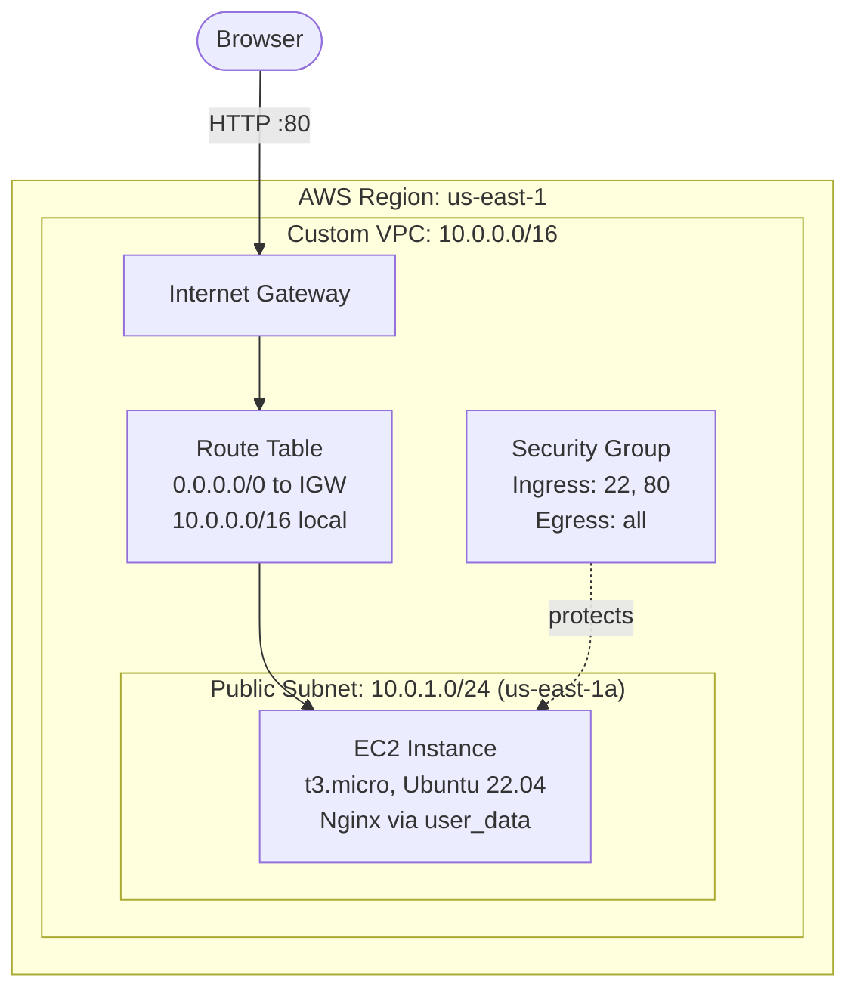
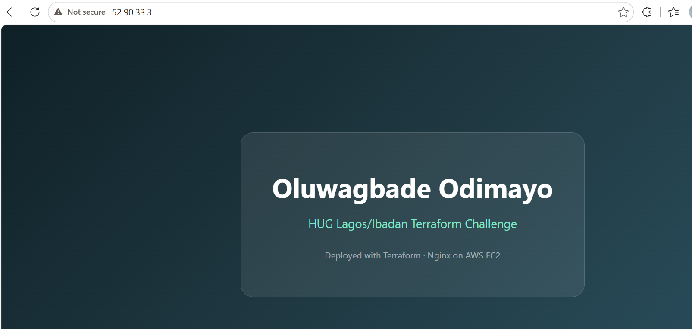
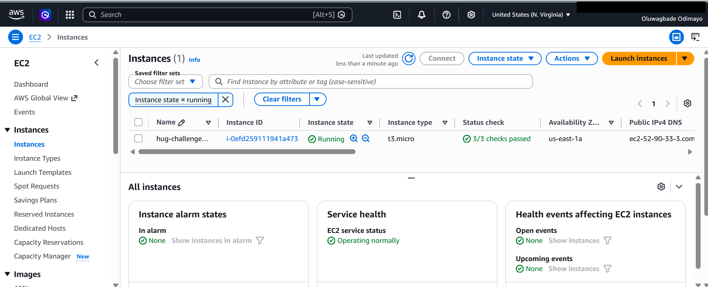

# Terraform AWS Web Server

> Provisioning a complete, internet facing web server on AWS using Infrastructure as Code. Built for Week 1 of the HUG Lagos/Ibadan 30 Days Terraform Challenge.

<p align="left">
  
  
  
  
  
  <a href="https://gbadedata.hashnode.dev/terraform-aws-vpc-from-scratch"></a>
</p>

**Full write up:** [There Is No "Public" Checkbox: What Building a VPC From Scratch in Terraform Actually Teaches You](https://gbadedata.hashnode.dev/terraform-aws-vpc-from-scratch)

---

## Overview

This repository provisions an entire network stack and a running web server on AWS from a single command. Nothing is created by clicking through the AWS Console. Every resource, from the private network down to the firewall rule that permits port 80, is declared in code, version controlled, and reproducible.

Running `terraform apply` builds seven resources in dependency order and returns a live URL. Running `terraform destroy` removes all of them. The infrastructure becomes disposable because the definition of it is permanent.

**What the deployed server serves:** a styled HTML landing page rendered by Nginx, with the operator name injected at boot time through a Terraform template.

---

## Architecture



A subnet in AWS is not public because of a setting named "public". It is public because its associated route table contains a route sending `0.0.0.0/0` traffic to an Internet Gateway. That single route is the entire distinction between a public and a private subnet, and it is the reason both the route table and its association exist as separate resources in this configuration.

---

## Resources provisioned

| # | Resource | Terraform type | Purpose | Cost |
|:--|:---------|:---------------|:--------|:-----|
| 1 | Virtual Private Cloud | `aws_vpc` | Isolated network, 65,536 addresses | Free |
| 2 | Public subnet | `aws_subnet` | 256 address slice in `us-east-1a` | Free |
| 3 | Internet Gateway | `aws_internet_gateway` | Bidirectional internet access for the VPC | Free |
| 4 | Route table | `aws_route_table` | Default route directing traffic to the gateway | Free |
| 5 | Route table association | `aws_route_table_association` | Binds the route table to the subnet | Free |
| 6 | Security group | `aws_security_group` | Stateful firewall permitting SSH and HTTP | Free |
| 7 | EC2 instance | `aws_instance` | Ubuntu 22.04 host running Nginx | Billed hourly |

One additional block, a `data "aws_ami"` source, queries AWS for the newest Ubuntu 22.04 image at plan time. It reads rather than creates, so it provisions nothing.

---

## Prerequisites

| Requirement | Minimum version | Verify with |
|:------------|:----------------|:------------|
| [Terraform](https://developer.hashicorp.com/terraform/install) | 1.5 | `terraform version` |
| [AWS CLI](https://docs.aws.amazon.com/cli/latest/userguide/getting-started-install.html) | 2.x | `aws --version` |
| AWS credentials | IAM user with EC2 and VPC permissions | `aws sts get-caller-identity` |
| [Git](https://git-scm.com/downloads) | any recent | `git --version` |

Configure credentials before deploying:

```bash
aws configure
```

---

## Project structure

```
.
├── main.tf                    Provider, network, security group, instance, AMI lookup
├── variables.tf               Input variable declarations with types and defaults
├── outputs.tf                 Values surfaced after apply
├── user_data.sh.tftpl         Templated boot script that installs Nginx
├── terraform.tfvars.example   Template for local variable values
├── .gitignore                 Excludes state files and local variable values
├── screenshots/               Deployment evidence
└── README.md
```

Terraform loads every `.tf` file in the working directory and treats them as one configuration. The split across three files is for human readability, not for the tool.

---

## Deployment

### 1. Clone and enter the repository

```bash
git clone https://github.com/gbadedata/terraform-aws-web-server.git
cd terraform-aws-web-server
```

### 2. Supply your variable values

```bash
cp terraform.tfvars.example terraform.tfvars
```

Edit `terraform.tfvars` and set the name that will appear on the served page:

```hcl
student_full_name = "Your Full Name"
```

`terraform.tfvars` is listed in `.gitignore` and is never committed. Variable values frequently contain secrets, so the pattern of declaring variables publicly and supplying values privately is worth applying from the very first project.

### 3. Initialize

```bash
terraform init
```

Downloads the AWS provider plugin and writes `.terraform.lock.hcl`, which pins the exact provider version so that every future run and every collaborator resolves identical dependencies.

### 4. Review the execution plan

```bash
terraform plan
```

Terraform compares three sources of truth: your configuration, the recorded state, and the live AWS account. It then prints the minimal set of actions needed to reconcile them. Nothing is created during a plan. Expect `Plan: 7 to add, 0 to change, 0 to destroy.`

### 5. Apply

```bash
terraform apply
```

Type `yes` at the confirmation prompt. Resources are created in dependency order, which Terraform derives automatically from references between blocks rather than from any ordering you specify.

### 6. Retrieve the URL

```bash
terraform output website_url
```

Allow ninety seconds to two minutes after apply completes. Terraform reports success once AWS has launched the instance, but the machine still needs to boot, refresh package indexes, install Nginx, and write the HTML file. A connection refused error during that window is expected rather than a failure.

---

## Configuration reference

All variables are declared in `variables.tf`. Only `student_full_name` is required; every other variable carries a default.

| Variable | Type | Default | Description |
|:---------|:-----|:--------|:------------|
| `student_full_name` | string | *(required)* | Name rendered on the served HTML page |
| `aws_region` | string | `us-east-1` | Target AWS region |
| `project_name` | string | `hug-challenge` | Prefix applied to resource names and tags |
| `instance_type` | string | `t3.micro` | EC2 instance size |

Override any default at the command line without editing files:

```bash
terraform apply -var="aws_region=eu-west-1" -var="instance_type=t3.small"
```

---

## Outputs

| Output | Description |
|:-------|:------------|
| `website_url` | Complete HTTP URL of the running server |
| `instance_public_ip` | Public IPv4 address assigned at launch |
| `instance_id` | EC2 instance identifier |

Outputs are metadata rather than infrastructure. Adding them and applying produces `0 added, 0 changed, 0 destroyed` while still recording the values in state. Retrieve any of them at any time:

```bash
terraform output
terraform output -raw instance_public_ip
```

---

## Screenshots

### Deployed web page



### EC2 instance running in the AWS Console



---

## Implementation notes

### Addressing

The VPC uses `10.0.0.0/16` and the subnet uses `10.0.1.0/24`. The prefix length states how many of the 32 bits in an IPv4 address are locked as the network portion, leaving the remainder free for hosts.

| Block | Locked bits | Free bits | Total addresses | Range |
|:------|:------------|:----------|:----------------|:------|
| `10.0.0.0/16` | 16 | 16 | 65,536 | 10.0.0.0 to 10.0.255.255 |
| `10.0.1.0/24` | 24 | 8 | 256 | 10.0.1.0 to 10.0.1.255 |
| `0.0.0.0/0` | 0 | 32 | all | every address, the default route |

A larger prefix number means a smaller network. `/16` is the largest VPC size AWS permits, which maximizes headroom at no cost. `/24` lands on an octet boundary, making the third octet function as a readable subnet number: `10.0.1.0/24`, `10.0.2.0/24`, and so on up to 256 subnets within the same VPC.

AWS reserves five addresses in every subnet (the first four and the last), so a `/24` yields 251 usable addresses rather than 256.

### AMI resolution

AMI identifiers differ per region and change whenever the publisher ships an updated build. Hard coding one produces a configuration that breaks in other regions and silently goes stale. The `data "aws_ami"` block instead queries for the most recent image matching a name pattern, filtered to Canonical's official AWS account ID (`099720109477`). Filtering by owner matters: anyone can publish an image with a convincing name, and pinning the publisher prevents resolving to a third party build.

### Boot configuration

`user_data.sh.tftpl` is rendered by Terraform's [`templatefile`](https://developer.hashicorp.com/terraform/language/functions/templatefile) function before it is ever transmitted to AWS. The `${student_name}` placeholder is substituted with the variable value, and the finished script is passed to the instance, where cloud-init executes it as root on first boot.

The script embeds its HTML in a heredoc opened with `<<'HTML'`. Quoting the delimiter prevents Bash from performing its own expansion on the block, which keeps the two templating layers, Terraform's and Bash's, from interfering with each other.

Because `user_data` runs only on first boot, `user_data_replace_on_change = true` is set on the instance. Editing the boot script therefore forces instance replacement, guaranteeing that the revised script actually executes rather than being silently ignored.

### Dependency resolution

No ordering is declared anywhere in this configuration. Terraform constructs a directed acyclic graph from references such as `aws_vpc.main.id` and `aws_security_group.web.id`, then creates resources in topological order and destroys them in reverse. The Internet Gateway is created before the route table that references it, and the instance is destroyed before the subnet that contains it, purely because those relationships are expressed as references.

---

## Security considerations

The default configuration opens SSH (port 22) to `0.0.0.0/0`, which is acceptable for a short lived demonstration instance but is not appropriate for anything persistent. To restrict access to a single address, add a variable for the permitted CIDR and reference it in the ingress rule:

```hcl
variable "allowed_ssh_cidr" {
  description = "CIDR permitted to reach SSH"
  type        = string
  default     = "0.0.0.0/0"
}
```

```hcl
ingress {
  description = "SSH"
  from_port   = 22
  to_port     = 22
  protocol    = "tcp"
  cidr_blocks = [var.allowed_ssh_cidr]
}
```

Then set `allowed_ssh_cidr = "YOUR.IP.ADDRESS/32"` in `terraform.tfvars`. A `/32` prefix locks all 32 bits, matching exactly one address. Retrieve your current address from [checkip.amazonaws.com](https://checkip.amazonaws.com).

**State file handling.** `terraform.tfstate` records every attribute of every managed resource, and for many resource types that includes credentials, private keys, and connection strings in plaintext. It is excluded by `.gitignore` in this repository and should never be committed. Team environments should use a [remote backend](https://developer.hashicorp.com/terraform/language/backend) such as S3 with DynamoDB state locking, which additionally prevents concurrent applies from corrupting state.

**Committed lock file.** `.terraform.lock.hcl` is deliberately not ignored. Committing it pins provider versions across every clone of the repository, making builds reproducible.

---

## Cost

Six of the seven resources carry no charge under any account type. Networking primitives in AWS, including VPCs, subnets, internet gateways, route tables, and security groups, are free.

The EC2 instance is the only billable component. A `t3.micro` in `us-east-1` is priced at roughly $0.0104 per hour on demand, so a complete deploy, verify, screenshot, and destroy cycle costs approximately one cent. Accounts still within the twelve month Free Tier window receive 750 instance hours per month at no charge.

Billing stops when the instance is terminated. Run `terraform destroy` once you have captured what you need.

---

## Teardown

```bash
terraform destroy
```

Type `yes` to confirm. All seven resources are removed in reverse dependency order.

The configuration in this repository is the durable artifact. The running infrastructure is not. Rebuilding an identical stack later takes a single `terraform apply` and under two minutes, which is the practical payoff of describing infrastructure as code rather than assembling it by hand.

---

## Troubleshooting

| Symptom | Cause | Resolution |
|:--------|:------|:-----------|
| `invalid AWS Region: var.aws_region` | Reference wrapped in quotes, passed as a literal string | Remove the quotes. References are expressions: `region = var.aws_region` |
| Page does not load immediately after apply | Cloud-init is still installing Nginx | Wait ninety seconds and refresh |
| Page still unreachable after several minutes | Boot script failed | SSH in and read `/var/log/cloud-init-output.log` |
| `NoCredentialProviders` or authentication errors | Credentials absent or expired | Run `aws configure`, verify with `aws sts get-caller-identity` |
| Console instance list appears empty | Wrong region selected in the console | Switch the region selector to N. Virginia (us-east-1) |
| Page content unchanged after editing the boot script | `user_data` executes only on first boot | Confirm `user_data_replace_on_change = true`, then apply again |
| `terraform plan` reports no changes after adding outputs | Outputs are metadata, not resources | Expected behavior. Apply anyway to record them in state |

---

## Challenge requirements

| Requirement | Implementation |
|:------------|:---------------|
| Custom VPC | `aws_vpc.main`, CIDR `10.0.0.0/16` |
| Public subnet | `aws_subnet.public`, CIDR `10.0.1.0/24` |
| Internet Gateway | `aws_internet_gateway.main` |
| Route table | `aws_route_table.public` plus `aws_route_table_association.public` |
| Security group allowing SSH (22) | Ingress rule, TCP port 22 |
| Security group allowing HTTP (80) | Ingress rule, TCP port 80 |
| Compute instance in the public subnet | `aws_instance.web`, `t3.micro` |
| Boot script installing Nginx | `user_data.sh.tftpl` rendered by `templatefile` |
| Page displaying full name | `${student_name}` substituted at render time |
| Page displaying challenge title | Static content in the template |
| Provider configuration | `main.tf` |
| Variables and outputs | `variables.tf` and `outputs.tf` |
| Resource dependencies | Implicit graph built from resource references |

---

## References

- [Terraform AWS Provider documentation](https://registry.terraform.io/providers/hashicorp/aws/latest/docs)
- [Terraform language documentation](https://developer.hashicorp.com/terraform/language)
- [`templatefile` function reference](https://developer.hashicorp.com/terraform/language/functions/templatefile)
- [Amazon VPC user guide](https://docs.aws.amazon.com/vpc/latest/userguide/what-is-amazon-vpc.html)
- [Running commands at instance launch](https://docs.aws.amazon.com/AWSEC2/latest/UserGuide/user-data.html)
- [EC2 on demand pricing](https://aws.amazon.com/ec2/pricing/on-demand/)

---

## License

Released under the MIT License. See [LICENSE](LICENSE) for details.
